# Productivity Dashboard With Hebrew Cal Times (Zmanim, Email, Cals, And More!)

A personalized dashboard application that displays Jewish/Hebrew calendar information, weather, news, email, and calendar data. This dashboard is designed for users who want to keep track of Hebrew dates, Zmanim (prayer times), Shabbat times, Israeli holidays, and integrate their Google services.

## Features

- **Hebrew Calendar**: Display current Hebrew date in English or Hebrew characters
- **Zmanim**: Daily prayer times for Jerusalem (configurable location)
- **Shabbat Times**: Candle lighting, Havdalah, and weekly Torah portion
- **Israeli Holidays**: Upcoming Jewish and Israeli national holidays
- **Red Alerts**: Israeli emergency alert system integration (requires configuration)
- **Weather**: Current weather and forecast (using Open-Meteo API)
- **Air Quality**: PM2.5 and AQI data (requires WAQI API key)
- **Google Integration**: Gmail and Google Calendar integration
- **News**: Israeli news feed from Google News
- **Responsive Design**: Works on desktop and mobile devices

## Screenshots

### Application Pages

<div align="center">

#### Home Dashboard
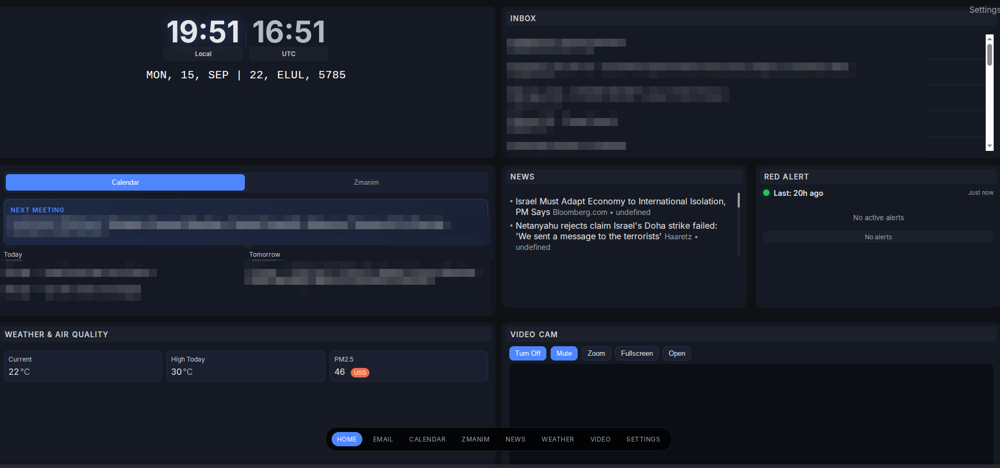

#### Email Page
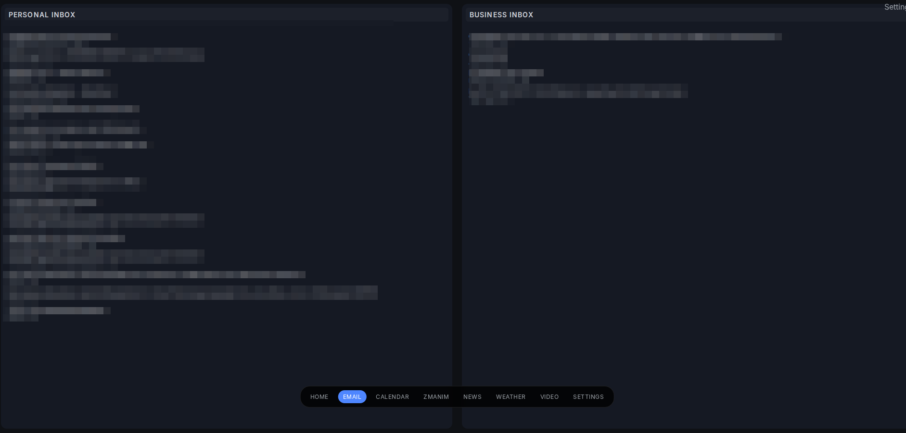

#### Calendar Page
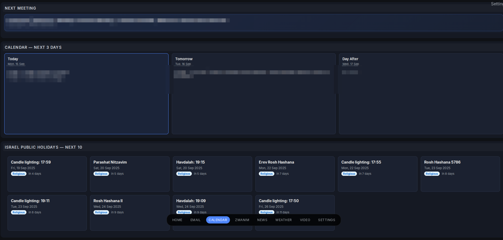

#### Zmanim Page
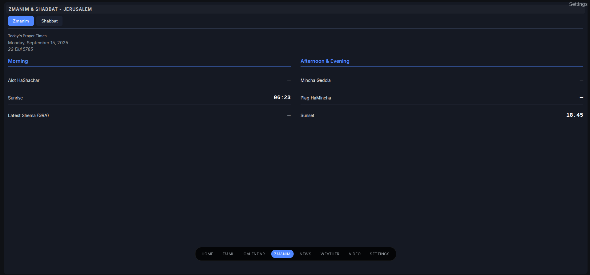

#### News Page
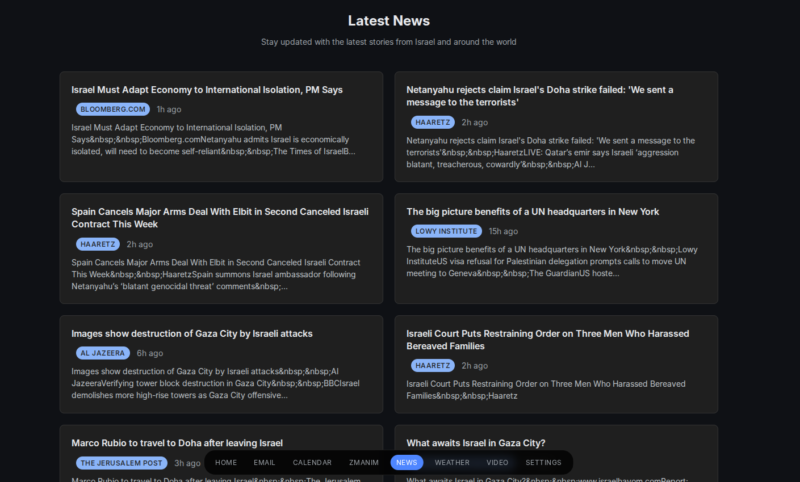

#### Weather Page
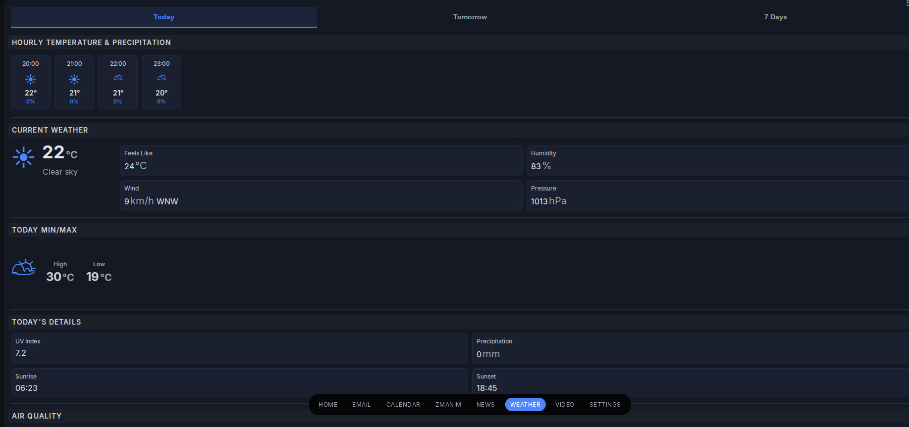

#### Settings Page
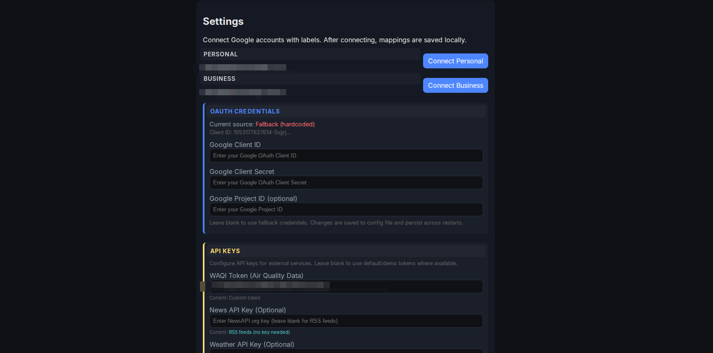

</div>

### UI Elements

Nav Bar

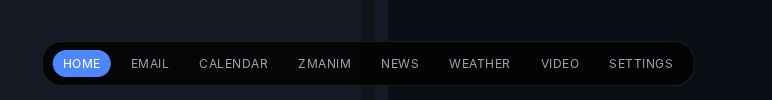

### Home Screen Widgets

<div align="center">

#### Clock Widget
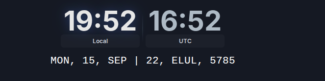

#### Weather Widget
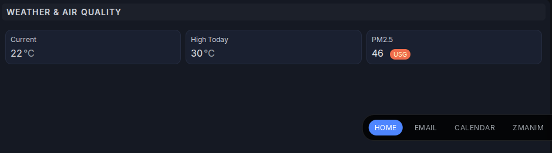

#### Zmanim Widget
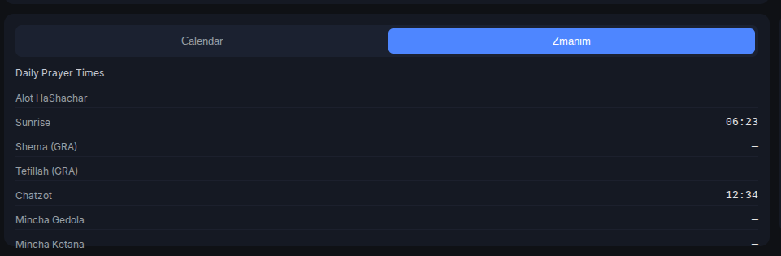

#### Calendar Widget
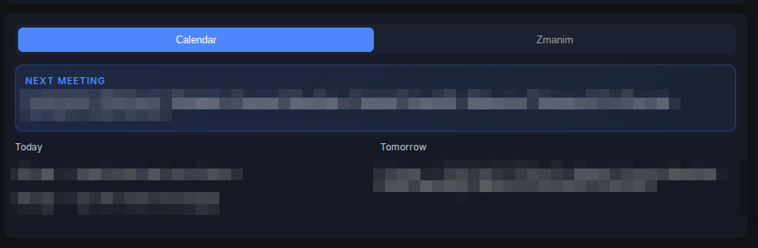

#### Holidays Widget
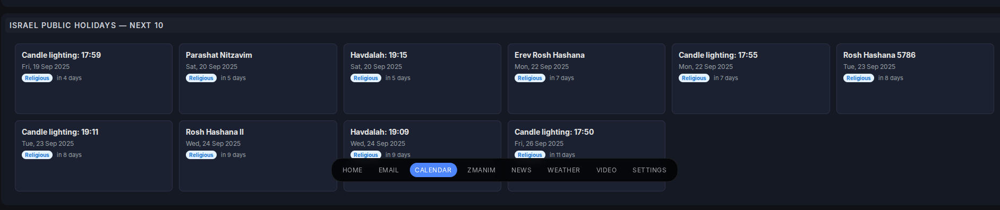

</div>

## Setup Instructions

### 1. Prerequisites

- Python 3.8 or higher
- Google Cloud Console account (for Gmail/Calendar integration)
- WAQI API key (optional, for air quality data)

### 2. Installation

#### Option A: Executable Installation (Recommended)

1. Clone the repository:
```bash
git clone <repository-url>
cd Hebrew-Dash
```

2. Build and install the executable:
```bash
# Build the executable (creates venv with uv and installs dependencies)
./build.sh

# Install to ~/.local/bin and create desktop launcher
./install.sh
```

Alternatively, use the update script to build and install in one step:
```bash
./update.sh
```

3. The application is now installed and can be launched:
   - From terminal: `hebrew-dashboard`
   - From application menu: "Hebrew Dashboard"

#### Option B: Development Installation

1. Clone the repository:
```bash
git clone <repository-url>
cd Hebrew-Dash
```

2. Create a virtual environment:
```bash
python -m venv venv
source venv/bin/activate  # On Windows: venv\Scripts\activate
```

3. Install dependencies:
```bash
pip install -r requirements.txt
```

### 3. Configuration

1. Copy the example environment file:
```bash
cp .env.example .env
```

2. Edit the `.env` file with your configuration:

#### Required for Google Services:
- `GOOGLE_CLIENT_ID`: Your Google OAuth Client ID
- `GOOGLE_CLIENT_SECRET`: Your Google OAuth Client Secret  
- `GOOGLE_PROJECT_ID`: Your Google Cloud Project ID

#### Optional:
- `WAQI_API_KEY`: API key from https://aqicn.org/api/
- `RED_ALERT_HISTORY_URL`: JSON endpoint for Israeli Red Alert data (see Red Alert Setup below)
- `PERSONAL_EMAIL`: Your personal Gmail address
- `BUSINESS_EMAIL`: Your business Gmail address
- `HEBREW_DATE_LANGUAGE`: Set to `english` or `hebrew`

### 4. Google OAuth Setup

1. Go to [Google Cloud Console](https://console.cloud.google.com/)
2. Create a new project or select an existing one
3. Enable the Gmail API and Google Calendar API
4. Create OAuth 2.0 credentials:
   - Go to "Credentials" → "Create Credentials" → "OAuth 2.0 Client IDs"
   - Choose "Desktop application"
   - Download the client configuration
5. Copy the `client_id`, `client_secret`, and `project_id` to your `.env` file

### 5. Red Alert Setup (Optional)

To enable Israeli Red Alert functionality:

1. Visit the official Pikud HaOref (Israeli Home Front Command) website
2. Look for their developer resources or API documentation
3. Find the JSON endpoint for alert history data
4. Add the URL to your `.env` file as `RED_ALERT_HISTORY_URL`

**Note**: You must find this URL yourself from official sources. The dashboard will not display Red Alert data without this configuration.

### 6. Running the Application

#### For Executable Installation:
```bash
hebrew-dashboard
```

#### For Development Installation:
```bash
python app.py
```

The dashboard will be available at `http://localhost:5000`

## Usage

### First Time Setup

1. Visit the Settings page (`/settings`)
2. Configure your API keys if not set in environment variables
3. Connect your Google accounts using the "Connect Personal" and "Connect Business" buttons
4. Choose your Hebrew date display preference (English or Hebrew characters)

### Navigation

- **Home**: Overview dashboard with time, weather, and quick info
- **Email**: View recent emails from connected Gmail accounts
- **Calendar**: Today's and upcoming calendar events
- **Zmanim**: Daily prayer times and Hebrew calendar information
- **News**: Latest Israeli news headlines
- **Weather**: Detailed weather information and forecast
- **Settings**: Configure API keys, accounts, and preferences

### Hebrew Date Display

You can choose between two display formats:
- **English**: "22 Elul 5785"
- **Hebrew**: "כ״ב אלול תשפ״ה"

Change this setting in the Settings page or by setting `HEBREW_DATE_LANGUAGE=hebrew` in your `.env` file.

## API Keys and Services

### Required APIs:
- **Google APIs**: Gmail and Calendar (free with Google account)

### Optional APIs:
- **WAQI (World Air Quality Index)**: Free API for air quality data
  - Sign up at https://aqicn.org/api/
  - Add your token to `WAQI_API_KEY` in `.env`

### Free APIs Used:
- **Open-Meteo**: Weather data (no API key required)
- **HebCal**: Hebrew calendar and Zmanim data (no API key required)
- **Google News RSS**: News headlines (no API key required)

## Configuration Options

### Environment Variables

| Variable | Description | Default |
|----------|-------------|---------|
| `APP_TITLE` | Application title | "Hebrew Dashboard" |
| `HOST` | Server host | "127.0.0.1" |
| `PORT` | Server port | "5000" |
| `FLASK_DEBUG` | Debug mode | "1" |
| `HEBREW_DATE_LANGUAGE` | Hebrew date format | "english" |
| `RED_ALERT_HISTORY_URL` | Red alert API URL | Required for Red Alert functionality |

### Location Settings

The dashboard is configured for Jerusalem by default. To change the location for weather and Zmanim:

1. Weather: Modify `DEFAULT_LAT` and `DEFAULT_LON` in `app.py`
2. Zmanim: Change the `geonameid` parameter in the HebCal API calls (currently set to 281184 for Jerusalem)

## Troubleshooting

### Common Issues:

1. **Google Authentication Fails**:
   - Verify your OAuth credentials are correct
   - Ensure Gmail and Calendar APIs are enabled in Google Cloud Console
   - Check that redirect URIs include `http://localhost`

2. **No Weather Data**:
   - Check your internet connection
   - Verify the Open-Meteo API is accessible

3. **Missing Hebrew Dates**:
   - Ensure HebCal API is accessible
   - Check your internet connection

4. **Air Quality Data Missing**:
   - Verify your WAQI API key is correct
   - Ensure the key is properly set in your `.env` file

### Logs

The application logs errors to the console. Run with `FLASK_DEBUG=1` for detailed error messages.

## Development

### Project Structure

```
Hebrew-Dash/
├── app.py              # Main Flask application
├── requirements.txt    # Python dependencies
├── .env.example       # Environment variables template
├── templates/         # HTML templates
│   ├── index.html     # Main dashboard
│   ├── settings.html  # Settings page
│   └── ...           # Other page templates
└── static/           # CSS, JavaScript, and other static files
```

### Adding Features

1. Add new routes in `app.py`
2. Create corresponding HTML templates in `templates/`
3. Add navigation links in `templates/_bottom_nav.html`
4. Update CSS in `static/css/style.css`

## License

This project is open source. Feel free to modify and distribute according to your needs.
 